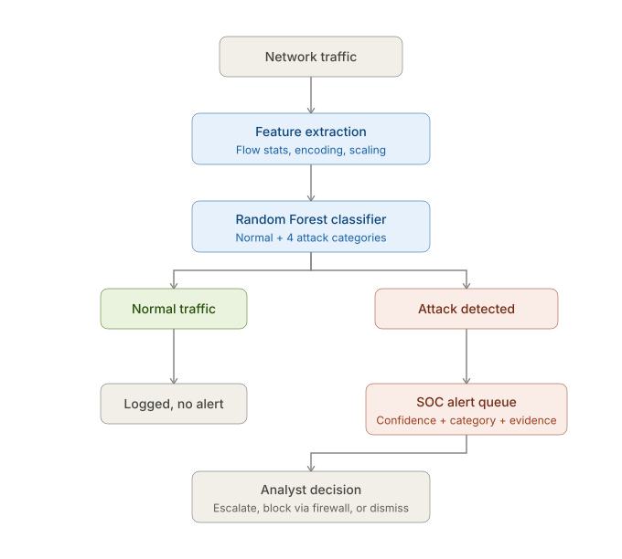

# Sign-Sight 👁️

**ML-powered network intrusion detector for SOC teams.**

> 📌 **Status: initial concept.** This repository currently captures the design and roadmap for Sign-Sight — the codebase is not built yet. Everything below describes the intended direction, based on the **Student Edition challenge: Network Intrusion Detector using ML**.

Sign-Sight is a network intrusion detection system built around a machine-learning classifier that surfaces anomalous traffic to security analysts. Unlike a traditional signature-based IDS, Sign-Sight learns what "normal" traffic looks like and flags novel attacks that signatures miss — helping analysts catch threats without drowning in rules.

---

## 🎯 The Challenge

> **Scenario** — You're on the network-security team. The signature-based IDS misses novel attacks, so you need an ML model to surface anomalous traffic to analysts.

> **Solve this** — An ML classifier that labels traffic normal vs. attack (and a few attack types) with honest evaluation, outputting alerts for the SOC — **not auto-blocks**.

Sign-Sight is built around three enterprise-grade requirements:

1. **Honest evaluation** — report precision / recall / false-positive rate / AUC, not just accuracy.
2. **Production readiness** — handle class imbalance and discuss model drift.
3. **Human-in-the-loop** — alert the SOC rather than auto-blocking traffic.

---

## ✨ Features

- **ML-based detection** — a Random Forest classifier labels network flows as *normal* or *attack* (with a few attack-type categories).
- **Honest metrics** — precision, recall, false-positive rate, and AUC reported alongside accuracy.
- **Class-imbalance handling** — techniques to cope with heavily skewed normal-vs-attack distributions.
- **Drift awareness** — monitoring and discussion of model drift over time.
- **SOC-friendly alerts** — alerts carry **confidence, attack category, and evidence** for analyst review.
- **No auto-blocking** — the system recommends; human analysts decide (escalate, block via firewall, or dismiss).
- **Alert persistence** — PostgreSQL-backed storage for alert history and analysis (via Docker Compose).

---

## 🔄 Pipeline



The intended flow:

```
Network traffic
      │
      ▼
Feature extraction        ←  flow stats, encoding, scaling
      │
      ▼
Random Forest classifier  ←  Normal + 4 attack categories
      │
      ├──▶ Normal traffic  ──▶  Logged, no alert
      │
      └──▶ Attack detected ──▶  SOC alert queue  (confidence + category + evidence)
                                       │
                                       ▼
                              Analyst decision  (escalate, block via firewall, or dismiss)
```

Design principles:

- **Alert, don't block** — the model never takes enforcement action; it raises alerts for SOC review.
- **Explainable output** — each alert carries confidence, category, and evidence so analysts can triage quickly.
- **Separate concerns** — data ingestion, model training, inference, and alerting are decoupled.

---

## 🗃️ Datasets

Sign-Sight targets standard public intrusion-detection datasets:

| Dataset | Description | Source |
| --- | --- | --- |
| **NSL-KDD** | Cleaned version of KDD Cup '99; good for benchmarking classifiers. | [unb.ca/cic/datasets/nsl.html](https://www.unb.ca/cic/datasets/nsl.html) |
| **CICIDS2017** | Modern, realistic traffic captures with a wide range of attack types. | [unb.ca/cic/datasets/ids-2017.html](https://www.unb.ca/cic/datasets/ids-2017.html) |
| **UNSW-NB15** | Modern network traffic with synthetic attack behaviors; main dataset portal. | [researchdata.edu.au/the-unsw-nb15-dataset/1957529](https://researchdata.edu.au/the-unsw-nb15-dataset/1957529) |
| **UNSW-NB15 (pre-split CSVs)** | Ready-to-use training/test CSV splits. | [figshare.com/articles/dataset/UNSW_NB15_training-set_csv/29149946](https://figshare.com/articles/dataset/UNSW_NB15_training-set_csv/29149946) |

> ⚠️ Dataset licensing differs per source — check terms before redistribution.

---

## 🧪 Evaluation

Accuracy alone is misleading for intrusion detection (attacks are rare). Sign-Sight reports:

- **Precision** — of flagged alerts, how many are real attacks
- **Recall** — of real attacks, how many were caught
- **False-positive rate (FPR)** — how much noise analysts must triage
- **AUC (ROC)** — overall discrimination ability across thresholds

Additionally:

- **Class imbalance** — evaluated with stratified sampling, class weights, and/or resampling, with the tradeoffs documented.
- **Model drift** — monitored via feature/prediction distributions over time, with a retraining strategy discussed.

---

## 🚀 Getting Started

### Prerequisites

- Python 3.10+
- Docker (for the alert database)
- scikit-learn and standard data-science tooling

### Setup (planned)

```bash
# 1. Clone the repo
git clone https://github.com/<your-org>/Sign-Sight.git
cd Sign-Sight

# 2. Create a virtualenv and install dependencies
python -m venv .venv
source .venv/bin/activate
pip install -r requirements.txt

# 3. Start the alert database (PostgreSQL)
docker compose up -d

# 4. Run the training pipeline
python -m sign_sight.train --data datasets/nsl-kdd.csv

# 5. Run inference / alert generation
python -m sign_sight.detect --interface eth0 --alert-to db
```

> ⚠️ The codebase is under active development — commands above outline the intended interface.

---

## 📁 Project Structure

```
Sign-Sight/
├── docker-compose.yml            # Alert database (PostgreSQL)
├── nids_pipeline_flowchart.svg   # Pipeline diagram (also embedded above)
├── .env                          # Local secrets — do not commit (add to .gitignore)
├── data/                         # Datasets and Postgres data volume
│   └── postgres_data/
├── sign_sight/                   # Main package (planned)
│   ├── ingest/                   # Dataset ingestion + preprocessing
│   ├── features/                 # Feature engineering
│   ├── models/                   # Classifier training & evaluation
│   ├── detect/                   # Live inference
│   └── alerting/                 # SOC alert generation & persistence
└── tests/                        # Unit & integration tests
```

---

## 🗺️ Roadmap

- [ ] Data ingestion for NSL-KDD / CICIDS2017 / UNSW-NB15
- [ ] Baseline Random Forest classifier with full metric reporting (normal + 4 attack categories)
- [ ] Class-imbalance handling and evaluation
- [ ] Drift detection & retraining strategy
- [ ] Live capture → inference → alert pipeline
- [ ] Alert dashboard / API for analysts
- [ ] CI/CD with dataset-based regression testing

---

## 🤝 Contributing

Issues and pull requests are welcome. For major changes, please open an issue first to discuss what you'd like to change.

## 📄 License

To be determined.