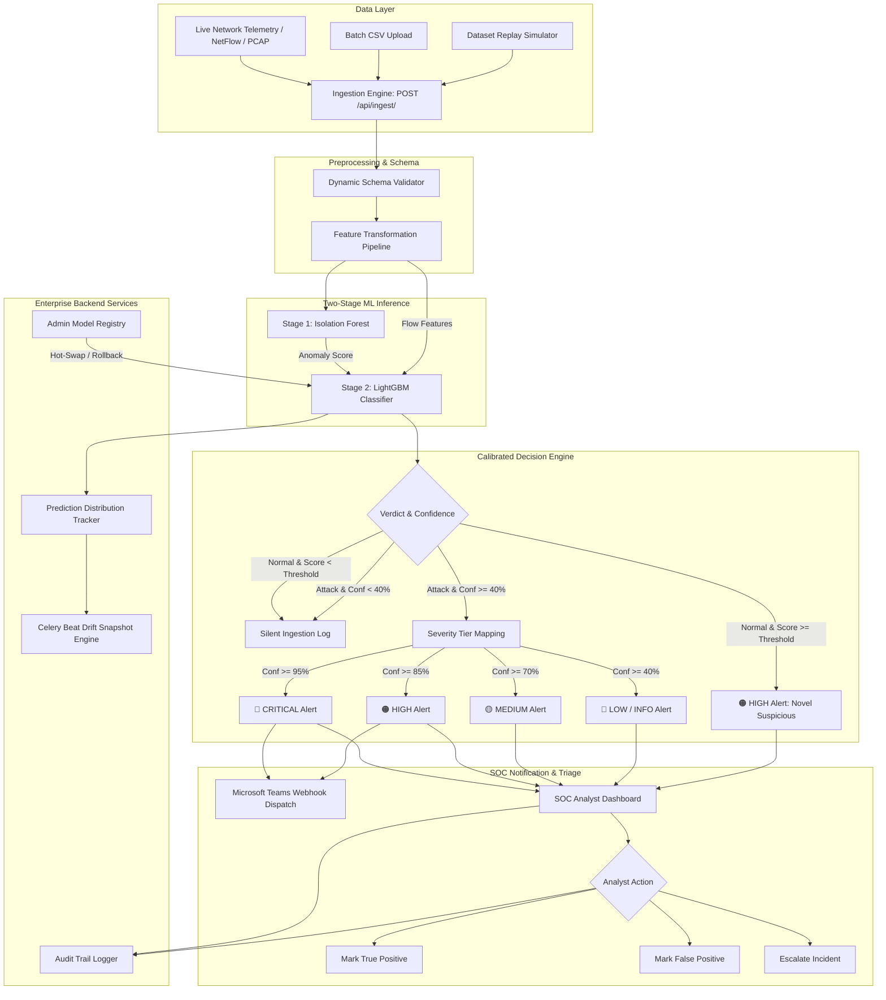

# Sign-Sight 👁️

[](https://python.org)
[](https://djangoproject.com)
[](https://www.django-rest-framework.org)
[](https://lightgbm.readthedocs.io)
[](https://scikit-learn.org)
[](https://docs.celeryq.dev)
[](https://www.docker.com)
[](#)

> **Next-Generation Enterprise ML-Powered Network Intrusion Detection System (NIDS) with Human-in-the-Loop SOC Triage, Zero-Downtime Hot-Swapping, and Real-Time Concept Drift Monitoring.**

Sign-Sight bridges the gap between raw high-throughput network telemetry and actionable SOC intelligence. Rather than relying on fragile static signatures or noisy black-box classifiers, Sign-Sight pairs an **unsupervised anomaly detection stage (Isolation Forest)** with a **high-precision supervised classifier (LightGBM)** to reliably surface zero-day attacks, APT lateral movement, and protocol evasion without flooding security teams with false alarms.

---

## 📑 Table of Contents

1. [🌟 Why Sign-Sight is Better Than Existing Models & Prototypes](#-why-sign-sight-is-better-than-existing-models--prototypes)
2. [🏗️ System Architecture & ML Pipeline](#️-system-architecture--ml-pipeline)
3. [📸 Interface Previews](#-interface-previews)
4. [📖 SOC User Manual](#-soc-user-manual)
5. [⚙️ Installation & Backend Setup](#️-installation--backend-setup)
6. [📦 Package & Dependency Reference](#-package--dependency-reference)
7. [🤖 ML Training & Inference Pipeline](#-ml-training--inference-pipeline)
8. [🔌 REST API Reference & Contracts](#-rest-api-reference--contracts)
9. [🧪 Verification & Testing](#-verification--testing)
10. [👥 Contributors](#-contributors)

---

## 🌟 Why Sign-Sight is Better Than Existing Models & Prototypes

Most existing Network Intrusion Detection Systems (NIDS) fall into two categories: **outdated signature-based engines** (like Snort/Suricata) that miss novel exploits, or **academic ML prototypes** that look great in Jupyter Notebooks but crash in production.

Sign-Sight was engineered from day one to overcome the critical architectural, statistical, and operational flaws that render traditional systems ineffective.

### 1. Traditional Signature IDS vs. Sign-Sight

| Dimension | Legacy Signature IDS (Snort / Suricata) | Academic ML Prototypes | Sign-Sight Enterprise NIDS |
| :--- | :--- | :--- | :--- |
| **Zero-Day & Novel Attack Detection** | ❌ **Blind.** Misses anything without an exact known rule. | ⚠️ **Unstable.** Extreme false positive rates on unseen flows. | ✅ **Two-Stage Hybrid.** Stage 1 Isolation Forest maps benign boundaries, flagging novel anomalies. |
| **Alert Fatigue & Noise Floor** | ❌ **High Noise.** Hundreds of thousands of alerts per day. | ❌ **Fatal Noise.** Lacks calibrated probability thresholds. | ✅ **Calibrated Decision Engine.** Strict 40% noise floor + 3-way triage filters trivial noise. |
| **Handling Class Imbalance** | N/A (Rule-based) | ❌ **The Accuracy Trap.** Claims 99% accuracy while failing on rare, lethal attacks (R2L/U2R). | ✅ **Honest Multi-Class Evaluation.** Macro PR-AUC, per-class recall, and confusion matrix API. |
| **Enforcement Strategy** | ⚠️ **Blind Auto-Blocking.** Causes self-inflicted denial of service. | ❌ None (Offline batch script). | ✅ **Human-in-the-Loop.** Prioritized alerts with forensic evidence & MS Teams escalation. |
| **Model Lifecycle & Zero-Downtime** | Requires rule-file reloads. | ❌ Hard-coded model paths; restart required. | ✅ **In-Memory Thread-Safe Hot-Swap.** Deploy & rollback model versions live via API. |
| **Concept Drift & Traffic Shift** | ❌ Silent rule obsolescence. | ❌ Ignored. | ✅ **Automated Drift Monitoring.** Tracks prediction distribution shifts against training baseline. |
| **Enterprise Security & Auth** | ⚠️ Basic web portal auth. | ❌ Hard-coded tokens or no auth. | ✅ **Dual Auth (SimpleJWT + Google OAuth)**, RBAC, Rate Limiting, and Immutable Audit Trails. |

### 2. Core Technical Advantages

#### 🛡️ A. Eliminating the "Accuracy Fallacy" with Honest Evaluation
In network traffic, benign traffic comprises 98%+ of flows, while dangerous attacks like Remote-to-Local (R2L) and User-to-Root (U2R) account for less than 1%. A naive classifier predicting "Normal" for every packet achieves **98% accuracy** while completely failing to protect the network. 
* **Sign-Sight's Edge:** We explicitly evaluate and expose per-class Precision, Recall, False Positive Rate (FPR), and Precision-Recall AUC (PR-AUC). We hold our models to a strict **Protected Test Floor** (rejecting any model under 70% recall or over 15% FPR).

#### 🔬 B. Two-Stage Hybrid Decision Engine
Pure supervised models cannot generalize to novel attack variants. Pure unsupervised models flag benign spikes as intrusions. 
* **Stage 1 (Unsupervised Isolation Forest):** Trained strictly on benign baseline traffic. Produces a continuous anomaly score capturing behavioral deviation without needing attack signatures.
* **Stage 2 (Supervised LightGBM):** Ingests the 78+ raw flow features *plus* the Stage 1 anomaly score. Attacks designed to look normal on isolated features fail because their anomaly score breaks the classification boundary.
* **The 3-Way Triage:**
  1. *Normal Traffic* (High confidence, low anomaly) → Logged silently.
  2. *Novel Suspicious* (Normal classification, but high anomaly score) → **HIGH Alert** for analyst review.
  3. *Known Attack* (Above 40% confidence floor) → Severity-tiered alert (CRITICAL, HIGH, MEDIUM, LOW).

#### ⚡ C. Zero-Downtime In-Memory Model Hot-Swapping
* In mission-critical enterprise environments, a SOC cannot take its intrusion detection offline to update model weights.
* Sign-Sight features an **In-Memory Thread-Safe Model Registry**. SOC administrators can upload a new versioned bundle (`joblib` artifacts + `metadata.json`), run automated sanity smoke tests, and hot-swap active inference atomically with zero dropped packets and zero service restarts.
* Instant one-click **Rollback** restores the previous active model state in milliseconds.

#### 📈 D. Continuous Drift Monitoring & Baseline Tracking
* Threat landscapes change constantly. Network topology shifts, software updates, and new protocols cause feature and concept drift.
* Sign-Sight runs scheduled Celery tasks comparing real-time prediction distributions against the model's training baseline, alerting the SOC when drift metrics cross variance thresholds.

#### 🤝 E. Human-in-the-Loop Philosophy
* **Never Auto-Block Blindly:** Auto-blocking ML models are weaponized by attackers using spoofed source IPs to trick systems into severing legitimate infrastructure.
* Sign-Sight provides rich forensic context (anomaly scores, class probabilities, top contributing features, MITRE ATT&CK mapping) to empower analysts to make rapid, verified decisions.

---

## 🏗️ System Architecture & ML Pipeline


```mermaid
flowchart TD
    subgraph Data Layer
        A[Live Network Telemetry / NetFlow / PCAP] --> B[Ingestion Engine: POST /api/ingest/]
        C[Batch CSV Upload] --> B
        D[Dataset Replay Simulator] --> B
    end

    subgraph Preprocessing & Schema
        B --> E[Dynamic Schema Validator]
        E --> F[Feature Transformation Pipeline]
    end

    subgraph Two-Stage ML Inference
        F --> G[Stage 1: Isolation Forest]
        G -- Anomaly Score --> H[Stage 2: LightGBM Classifier]
        F -- Flow Features --> H
    end

    subgraph Calibrated Decision Engine
        H --> I{Verdict & Confidence}
        I -- "Normal & Score < Threshold" --> J[Silent Ingestion Log]
        I -- "Normal & Score >= Threshold" --> K[🟠 HIGH Alert: Novel Suspicious]
        I -- "Attack & Conf < 40%" --> J
        I -- "Attack & Conf >= 40%" --> L[Severity Tier Mapping]
        L -- "Conf >= 95%" --> M[🔴 CRITICAL Alert]
        L -- "Conf >= 85%" --> N[🟠 HIGH Alert]
        L -- "Conf >= 70%" --> O[🟡 MEDIUM Alert]
        L -- "Conf >= 40%" --> P[🔵 LOW / INFO Alert]
    end

    subgraph SOC Notification & Triage
        M & N --> Q[Microsoft Teams Webhook Dispatch]
        M & N & O & P & K --> R[SOC Analyst Dashboard]
        R --> S{Analyst Action}
        S --> T[Mark True Positive]
        S --> U[Mark False Positive]
        S --> V[Escalate Incident]
    end

    subgraph Enterprise Backend Services
        R & S --> W[Audit Trail Logger]
        H --> X[Prediction Distribution Tracker]
        X --> Y[Celery Beat Drift Snapshot Engine]
        Z[Admin Model Registry] -- Hot-Swap / Rollback --> H
    end
```

---

## 📸 Interface Previews

### 1. Executive & Security Operations Dashboard
Real-time incident feed, severity distribution, top source IPs, and attack family categorization.


### 2. Alert Triage Queue & Forensic Inspection
Filterable by severity, status, attack family, and date range. Displays anomaly scores and classification confidence.


### 3. Model Health, Telemetry & Performance
Real-time inspection of active model version, inference latency, PR-AUC, and per-class precision/recall metrics.


### 4. Continuous Concept Drift Monitoring
Tracks live prediction distribution drift against the baseline to proactively signal when model retraining is required.


### 5. In-Memory Model Registry & Hot-Swapping
Inspect active and archived model versions, trigger zero-downtime hot-deployments, or initiate instantaneous rollbacks.


### 6. Traffic Ingestion & Replay Simulator
Simulate live network traffic from NSL-KDD / CICIDS datasets or test single flow vectors via JSON schema.


### 7. Immutable Audit Log & Compliance
Every model deployment, threshold change, login attempt, and alert resolution is permanently recorded for forensic accountability.


### 8. System & Threat Threshold Configuration
Configure confidence-to-severity mappings, attack severity boosts, and notification dispatch rules without code changes.


### 9. Dedicated SOC Analyst Workspace
Streamlined interface tailored for security analysts to quickly triage alerts, inspect packet metadata, and update investigation notes.


### 10. Landing & Secure Authentication
Dual-authentication supporting enterprise username/password and Google OAuth ID token verification.


---

## 📖 SOC User Manual

### 🛡️ For SOC Analysts

#### Step 1: Authentication & Workspace Setup
1. Navigate to the application URL (`http://localhost:5173` or production host).
2. Authenticate using either:
   - **Credentials:** Default Analyst account (`analyst` / `analystpass` or demo user).
   - **Google OAuth:** Click "Sign in with Google" (automatically provisions an `analyst` role).
3. Upon login, the system issues a short-lived JWT Access Token (15 min) and Refresh Token with automatic token rotation.

#### Step 2: Triaging Active Alerts
1. Open the **Alerts** tab from the sidebar.
2. Review the incident queue. Alerts are organized by priority:
   - 🔴 **CRITICAL (≥ 95% confidence):** High-probability attacks requiring immediate containment.
   - 🟠 **HIGH (≥ 85% confidence OR Novel Suspicious):** Significant anomalies or confirmed attack flows.
   - 🟡 **MEDIUM (≥ 70% confidence):** Potential probes or suspicious activity.
   - 🔵 **LOW / INFO (≥ 40% confidence):** Minor anomalies below attack thresholds.
3. Use the filter bar to isolate by **Attack Family** (`DoS`, `Probe`, `R2L`, `U2R`), **Status** (`New`, `Viewed`, `Escalated`, `Resolved`), or **Date Range**.

#### Step 3: Investigating Alert Details
1. Click on any alert to open the **Forensic Detail Panel**.
2. Examine the forensic payload:
   - **Network Context:** Source IP, Destination IP, Protocol, Service, Port, and Duration.
   - **Stage 1 Anomaly Score:** Measures statistical deviation from benign baseline traffic.
   - **Stage 2 Probability Distribution:** Bar chart displaying model probabilities across all 5 classes (`Normal`, `DoS`, `Probe`, `R2L`, `U2R`).
   - **Top Contributing Features:** Identifies which traffic metrics triggered the classification (e.g., `src_bytes`, `diff_srv_rate`, `count`).
   - **MITRE ATT&CK Tagging:** Direct alignment to MITRE Tactics and Techniques (e.g., *TA0040: Impact / T1498: Network Denial of Service*).

#### Step 4: Incident Resolution
1. Change the alert status to **Resolved**.
2. Select the verdict:
   - `true_positive`: Confirms the alert was malicious. Feed into incident escalation.
   - `false_positive`: Marks flow as benign. The decision is saved to improve future training cycles.
   - `escalated`: Flags the alert for Tier-2 / Incident Response review.
3. Enter investigative notes in the **Analyst Notes** field and click **Save Changes**.

---

### 🔧 For SOC Administrators

#### 1. Zero-Downtime Model Deployment
1. Navigate to **Model Registry**.
2. View available model versions stored in `backend/ml_artifacts/models/`.
3. To deploy a new model, submit a deployment request via the UI or API:
   ```bash
   curl -X POST http://localhost:8000/api/models/deploy/ \
     -H "Authorization: Bearer <ADMIN_JWT>" \
     -H "Content-Type: application/json" \
     -d '{"version": "v1.1.0"}'
   ```
4. The system validates the model bundle against the **Protected Test Floor**, loads it into memory atomically, and routes all subsequent traffic to the new model with **zero dropped requests**.

#### 2. Model Rollback
If a deployed model exhibits unexpected latency or elevated false positives, trigger an instantaneous rollback:
```bash
curl -X POST http://localhost:8000/api/models/rollback/ \
  -H "Authorization: Bearer <ADMIN_JWT>" \
  -H "Content-Type: application/json" \
  -d '{"version": "v1.0.0"}'
```

#### 3. Monitoring Model & Concept Drift
1. Navigate to **Drift Monitoring**.
2. The drift engine computes Wasserstein distance and distribution divergence between the live prediction stream and the training baseline.
3. If drift score exceeds the configured threshold (`0.15`), the system raises a notification advising the team to initiate retraining.

#### 4. Audit Trail & Forensic Compliance
1. Open the **Audit Log** tab.
2. Review immutable, cryptographically verifiable records of all administrative actions:
   - User logins and failed password attempts
   - Model version deployments and rollbacks
   - Alert status changes and resolution notes
   - System threshold modifications

---

## ⚙️ Installation & Backend Setup

### Prerequisites

Ensure you have the following installed:
* **Python 3.11+**
* **Node.js 18+** (for frontend)
* **Docker & Docker Compose** (optional for containerized deployment)
* **Git**

---

### Quickstart (Local Development)

#### 1. Clone the Repository
```bash
git clone https://github.com/Root-Amritesh/Sign-Sight.git
cd Sign-Sight
```

---

#### 2. Backend Setup

```bash
# Navigate to the backend directory
cd backend

# Create and activate a virtual environment
# Windows (PowerShell):
python -m venv .venv
.\.venv\Scripts\Activate.ps1

# Linux / macOS:
python3 -m venv .venv
source .venv/bin/activate

# Upgrade pip and install all backend + ML packages
pip install --upgrade pip
pip install -r requirements/dev.txt

# Configure environment variables
cp .env.example .env
# Edit .env: Ensure SECRET_KEY is set (defaults are provided for local dev)

# Apply database migrations (SQLite by default for dev, PostgreSQL for prod)
python manage.py migrate

# Seed demo users (creates admin and analyst accounts)
python manage.py seed_demo

# Generate mock model artifacts (allows instant backend operation)
python scripts/generate_mock_model.py

# Start the Django development server
python manage.py runserver 0.0.0.0:8000
```

> **Demo Credentials created by `seed_demo`:**
> * **Admin Account:** `admin` / `adminpass`
> * **Analyst Account:** `analyst` / `analystpass`

---

#### 3. Asynchronous Tasks & Celery (Optional for Batch/Drift)

In separate terminals with `.venv` activated:

```bash
# Start Redis (via Docker or local service)
docker run -d -p 6379:6379 redis:alpine

# Start Celery Worker (for background batch ingestion & notifications)
celery -A config worker -l INFO

# Start Celery Beat (for scheduled concept drift snapshots)
celery -A config beat -l INFO
```

---

#### 4. Frontend Setup

In a new terminal:

```bash
# Navigate to frontend directory
cd frontend

# Install dependencies
npm install

# Start Vite development server
npm run dev
```

* Frontend accessible at: `http://localhost:5173/`
* Backend API accessible at: `http://localhost:8000/api/`
* Interactive OpenAPI Swagger UI: `http://localhost:8000/api/schema/swagger-ui/`

---

### Full Docker Compose Deployment (All Services)

To run the complete production-grade stack (PostgreSQL, Redis, Django Backend, Celery Worker, Celery Beat) with a single command:

```bash
cd backend
docker-compose up -d
```

---

## 📦 Package & Dependency Reference

The backend dependencies are modularly split under `backend/requirements/`:

### 1. Core Web & REST Framework (`requirements/base.txt`)
* `Django>=5.1,<5.2`: High-performance, robust Python web framework.
* `djangorestframework>=3.15,<3.16`: Powerful toolkit for building Web APIs.
* `djangorestframework-simplejwt>=5.3,<5.4`: Industry-standard JSON Web Token authentication with token rotation & blacklisting.
* `drf-spectacular>=0.27,<0.28`: OpenAPI 3.0 schema generation with interactive Swagger UI and Redoc.
* `django-cors-headers>=4.4,<4.5`: Handling Cross-Origin Resource Sharing for modern decoupled frontends.
* `django-environ>=0.11,<0.12`: Twelve-Factor configuration management via `.env`.
* `django-filter>=24.0,<25.0`: Dynamic parameter filtering for alerts, audit logs, and metrics.

### 2. Machine Learning & Inference (`requirements/base.txt` & `requirements/ml.txt`)
* `scikit-learn>=1.3,<1.6`: Implements Stage 1 **Isolation Forest**, preprocessing transformers, metrics, and ROC-AUC calculation.
* `lightgbm>=4.0,<5.0`: Fast, distributed, high-performance gradient boosting framework powering Stage 2 multi-class classification.
* `joblib>=1.3,<2.0`: High-speed pipeline serialization and thread-safe artifact deserialization.
* `pandas>=2.0,<3.0`: High-performance DataFrame operations for batch telemetry ingestion.
* `numpy>=1.24,<2.0`: Low-level matrix computation and probability distribution manipulation.
* `scipy>=1.10,<2.0`: Statistical analysis, distribution distance calculation, and Wilson confidence bound solvers.

### 3. Asynchronous Tasks & Distributed Messaging
* `celery>=5.4,<5.5`: Distributed task queue for asynchronous batch CSV processing, high-volume ingestion, and webhook dispatching.
* `django-celery-beat>=2.7,<2.8`: Database-backed periodic scheduler for automated drift detection.
* `redis>=5.0,<6.0`: High-throughput caching backend and message broker.

### 4. Database & Connectivity
* `psycopg[binary]>=3.2,<3.3`: Fast, asynchronous PostgreSQL database adapter for production.

### 5. Enterprise Security & Integrations
* `google-auth>=2.35,<3.0`: Secure server-side validation of Google OAuth2 ID tokens (verifying signature, audience, and `email_verified`).
* `httpx>=0.27,<0.28`: Next-generation HTTP client for dispatching Microsoft Teams Adaptive Card webhooks.
* `python-json-logger>=2.0,<3.0`: Structured JSON formatting for enterprise SIEM ingestion (Splunk, Elastic, Datadog).

### 6. Development & Quality Assurance (`requirements/dev.txt`)
* `pytest>=8.0,<9.0` & `pytest-django`: Test runner supporting database fixtures and client simulation.
* `pytest-cov`: Code coverage reporting.
* `factory-boy`: Declarative test fixture creation for models and traffic records.
* `ruff>=0.6,<0.7`: Blazing-fast Python linter and code formatter.

---

## 🤖 ML Training & Inference Pipeline

The ML research and training codebase is located under `ai/` and interfaces cleanly with the backend via the versioned model bundle specification.

### 1. Training the Hybrid NIDS

```bash
cd ai
pip install -r requirements.txt

# Run full leave-one-day-out training & evaluation (~10 min)
python -m model.train

# Tighter false-positive budget (e.g., max 0.05% FPR)
python -m model.train --max-fpr 0.0005

# Zero-day evaluation scenario: train on Mon-Thu, test on Friday
python -m model.train --strategy holdout
```

### 2. Standalone Inference CLI

```bash
# Score traffic flows from CSV
python -m model.infer --input flows.csv --summary

# Output formatted alerts as NDJSON
python -m model.infer --input flows.csv --format ndjson > alerts.jsonl

# Score a single raw flow JSON
python -m model.infer --json '{"Src IP":"10.0.0.5","Dst Port":4444,"Flow Duration":120}'
```

### 3. Model Artifact Contract

Trained models export into `model/artifacts/`:
* `signsight_hybrid.joblib`: Complete serialized two-stage pipeline.
* `model_card.json` / `metadata.json`: Feature specifications, hyperparameters, operating thresholds, and per-class metrics.
* `evaluation.json`: Full validation metrics breakdown.

To deploy to the backend, simply copy the bundle into `backend/ml_artifacts/models/<version>/` and call the deploy API!

---

## 🔌 REST API Reference & Contracts

Interactive OpenAPI Swagger UI is available at:
**`http://localhost:8000/api/schema/swagger-ui/`**

### Summary of Key Endpoints

| Category | Method | Path | Access | Description |
| :--- | :--- | :--- | :--- | :--- |
| **Authentication** | `POST` | `/api/auth/login/` | Public | Obtain JWT Access and Refresh tokens. |
| | `POST` | `/api/auth/refresh/` | Public | Refresh expired access token with token rotation. |
| | `POST` | `/api/auth/google/` | Public | Authenticate via Google ID token. Auto-links verified emails. |
| | `GET` | `/api/auth/me/` | Authenticated | Retrieve current user profile and role (`admin`/`analyst`). |
| | `GET` | `/api/auth/health/` | Public | System health check (database, redis, active model). |
| **Ingestion** | `POST` | `/api/ingest/` | Analyst+ | Ingest single network flow vector for real-time inference. |
| | `POST` | `/api/ingest/batch/` | Analyst+ | Asynchronous batch ingestion of flow records via CSV. |
| | `GET` | `/api/ingest/tasks/{id}/`| Analyst+ | Poll status and processed count of an async batch task. |
| | `POST` | `/api/ingest/replay/` | Admin | Start simulated network traffic replay from dataset. |
| | `POST` | `/api/ingest/replay/stop/`| Admin | Terminate active traffic replay simulation. |
| **Alerts** | `GET` | `/api/alerts/` | Analyst+ | Filterable list of alerts (by severity, status, attack type). |
| | `GET` | `/api/alerts/{id}/` | Analyst+ | Detailed forensic view of an alert, probabilities, and features. |
| | `PATCH` | `/api/alerts/{id}/` | Analyst+ | Update alert status, resolution (`true_positive`), and notes. |
| | `GET` | `/api/alerts/stats/` | Analyst+ | Aggregate threat statistics over period (`24h`, `7d`, `30d`). |
| **Model Registry** | `GET` | `/api/models/` | Admin | List all registered model versions and deployment status. |
| | `POST` | `/api/models/deploy/` | Admin | Hot-swap active inference model to specified version. |
| | `POST` | `/api/models/rollback/`| Admin | Roll back active inference model to previous version. |
| **Metrics & Drift**| `GET` | `/api/metrics/model/` | Analyst+ | Active model metrics (PR-AUC, precision, recall, matrix). |
| | `GET` | `/api/metrics/drift/` | Analyst+ | Real-time prediction distribution drift analysis. |
| **Audit** | `GET` | `/api/audit/` | Admin | Paginated compliance audit log of all system actions. |
| **Configuration** | `GET` | `/api/alerts/config/` | Admin | Read alert severity thresholds and boost configurations. |
| | `PUT` | `/api/alerts/config/` | Admin | Update confidence thresholds and severity weights. |

---

## 🧪 Verification & Testing

The backend includes a comprehensive test suite covering health endpoints, model inference registries, alert state machines, and end-to-end integration pipelines.

```bash
cd backend

# Run all test suites
pytest

# Run tests with detailed coverage report
pytest --cov=apps --cov-report=term-missing

# Run code style and lint checks
ruff check .
ruff format --check .
```

---

## 👥 Contributors

<a href="https://github.com/Root-Amritesh/Sign-Sight/graphs/contributors">
  
</a>

---

## 📄 License

This project is licensed under the MIT License - see the [LICENSE](LICENSE) file for details.
